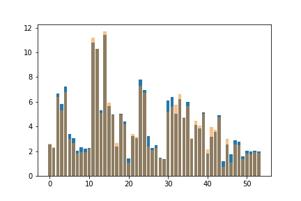
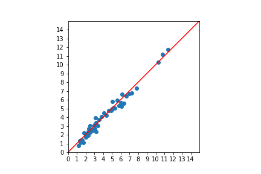

Support vector machine (SVM) benchmarks for the machine leraning predictions of
band gaps of semiconductors.

The training data comes from one study
(Phys. Rev. B 93, 115104 – Published 1 March 2016)
in my former group of Prof. Isao Tanaka at Kyoto University. Since the
license of these data have not been clear, these data need to be
obtained upon reqeust from Lee or me.

This repository includes the machine learning codes written by myself.

The support vector regression model was used for this prediction. 
The database including 270 materials was used. 80% of the database 
was randomly selected for training and the remaining 20% was used for validation. 
The validation result was shown as follow. 
Although I haven't optimized the parameters in the learning process,  
the obtained result looks excellent and is comparable to Fig. 5 in the aforementioned
PRB paper. The mean squared error in our prediction was about 0.13.

\textbf{Fig 1: The blue squares show the predicted bad gaps by support vector regression
(SVR) with 18 predictors.}

In Fig. 2,  fifty materials were randomly chosen for validation the SVR model
by comparing the results with the GW-DFT calculated band gaps. 
The x-axis and y-axis correspond to GW-DFT calculated band gaps and SVR-predicted band gaps (eV), respectively.

\textbf{Fig 2: The blue squares show the predicted bad gaps by support vector regression
(SVR) with 18 predictors.}

